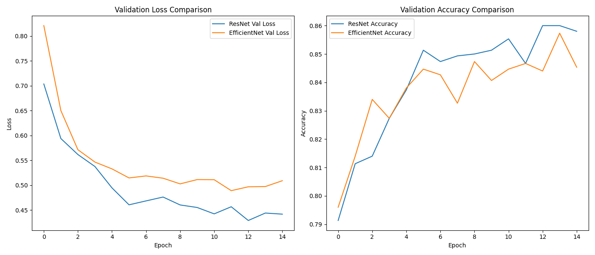
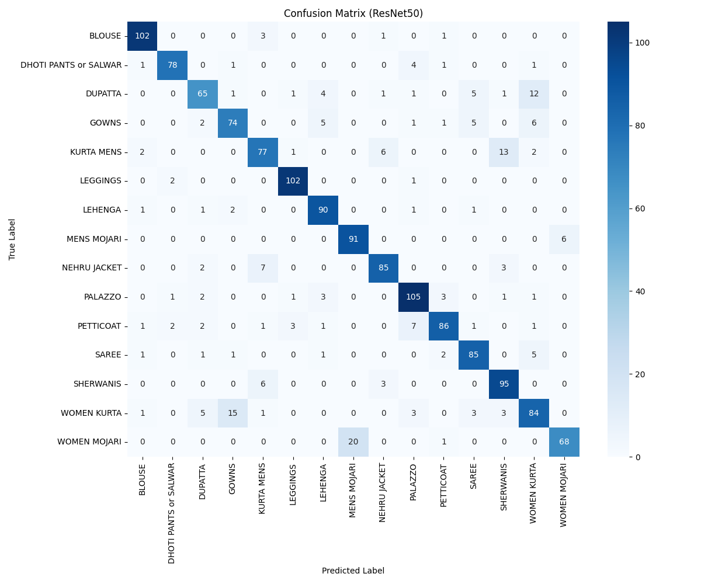

# Clothing Image Classification using Transfer Learning and  Meta Vision

🔗 **Live Demo**\
https://img-classifier-efficientnet-llama4-scout.streamlit.app/

This project builds an **image classification system for Indian ethnic
clothing** using the **IndoFashion dataset**.

The goal is to automatically classify garments such as **sarees, kurtas,
lehengas, sherwanis, and other traditional clothing items**.

To make training manageable, a **balanced subset dataset** was created
by selecting **500 valid images per class**, resulting in **7500 images
across 15 categories**.

The models were implemented using **PyTorch** and trained using
**transfer learning with pretrained CNN architectures**.

------------------------------------------------------------------------
## Test Images

To help reviewers quickly test the model, a set of sample images is provided.

Download test images here:

🔗 https://drive.google.com/drive/folders/1Di0b2wPs-KbediLzKNYBkIQrrqfJ-81n?usp=sharing

You can upload these images directly in the Streamlit app to evaluate the model predictions.

The test folder contains example images from multiple categories such as:

- Saree
- Kurta
- Lehenga
- Mojari
- Dupatta
- Sherwani
- Palazzo

This allows quick verification of the classification system without downloading the full IndoFashion dataset.
------------------------------------------------------------------------

# Project Overview

Pipeline implemented in this project:

1.  Dataset cleaning and subset creation\
2.  Image preprocessing and augmentation\
3.  Transfer learning with pretrained CNNs\
4.  Model training and validation\
5.  Performance evaluation\
6.  Deployment using Streamlit

Two deep learning models were trained and compared:

-   **ResNet50**
-   **EfficientNet-B0**

------------------------------------------------------------------------

# Dataset

Dataset Source\
https://indofashion.github.io/

The original dataset contains images of Indian ethnic clothing collected
from e-commerce websites.

For this project:

  Classes   Images per Class   Total Images
  --------- ------------------ --------------
  15        500                7500

Dataset cleaning steps:

-   Removed corrupt images
-   Filtered unsupported formats
-   Randomly selected **500 valid images per class**

This ensures a **balanced training dataset**.

------------------------------------------------------------------------

# Data Preprocessing

Images were processed using **PyTorch transforms**.

Preprocessing pipeline:

-   Resize images → **224 × 224**
-   Random horizontal flip
-   Random rotation (10°)
-   Convert image to tensor
-   Normalize using **ImageNet statistics**

These augmentations improve model generalization.

------------------------------------------------------------------------

# Model Architecture

## ResNet50

ResNet50 uses **residual connections** that allow deep neural networks
to train effectively.

Key idea:

F(x) + x

In this project:

-   Pretrained **ImageNet weights**
-   Backbone layers frozen
-   Final fully connected layer replaced with **15-class classifier**

------------------------------------------------------------------------

## EfficientNet-B0

EfficientNet uses **compound scaling** to balance:

-   network depth
-   network width
-   input resolution

Advantages:

-   High accuracy
-   Fewer parameters
-   Efficient training

As with ResNet:

-   Pretrained ImageNet weights were used
-   Only the final classifier layer was trained.

------------------------------------------------------------------------

# Training Configuration

  Parameter        Value
  ---------------- -----------------------
  Optimizer        Adam
  Loss Function    CrossEntropyLoss
  Batch Size       32
  Epochs           15
  Learning Rate    0.001 (ResNet)
  Learning Rate    0.0005 (EfficientNet)
  Scheduler        StepLR
  Early Stopping   Patience = 3

Training improvements:

-   Learning rate scheduling
-   Early stopping to prevent overfitting

------------------------------------------------------------------------

# Results

  Model             Validation Accuracy
  ----------------- ---------------------
  ResNet50          \~86%
  EfficientNet-B0   \~85%

ResNet50 achieved slightly higher validation accuracy.

------------------------------------------------------------------------

# Model Evaluation

The trained models were evaluated using validation accuracy, training
curves, and confusion matrix analysis.

## Training Curves

Observations:

-   Both models converge within **10--12 epochs**
-   Validation loss stabilizes as training progresses
-   No significant overfitting observed

## Confusion Matrix

Observations:

-   Most predictions lie along the **diagonal**, indicating correct
    classifications
-   Minor confusion between visually similar classes:
    -   Kurta Mens vs Women Kurta
    -   Men Mojari vs Women Mojari

------------------------------------------------------------------------

# Streamlit Demo

An interactive Streamlit application is included.

Users can:

-   Upload a clothing image
-   View **Top‑3 predictions**
-   See prediction confidence
-   Visualize class probabilities

🔗 **Live App**\
https://img-classifier-efficientnet-llama4-scout.streamlit.app/

------------------------------------------------------------------------

# Future Improvements

Potential improvements for higher performance:

-   Fine‑tuning deeper layers of pretrained models
-   Using larger EfficientNet variants
-   Stronger data augmentation
-   Ensemble learning across multiple models
-   Training with larger datasets
